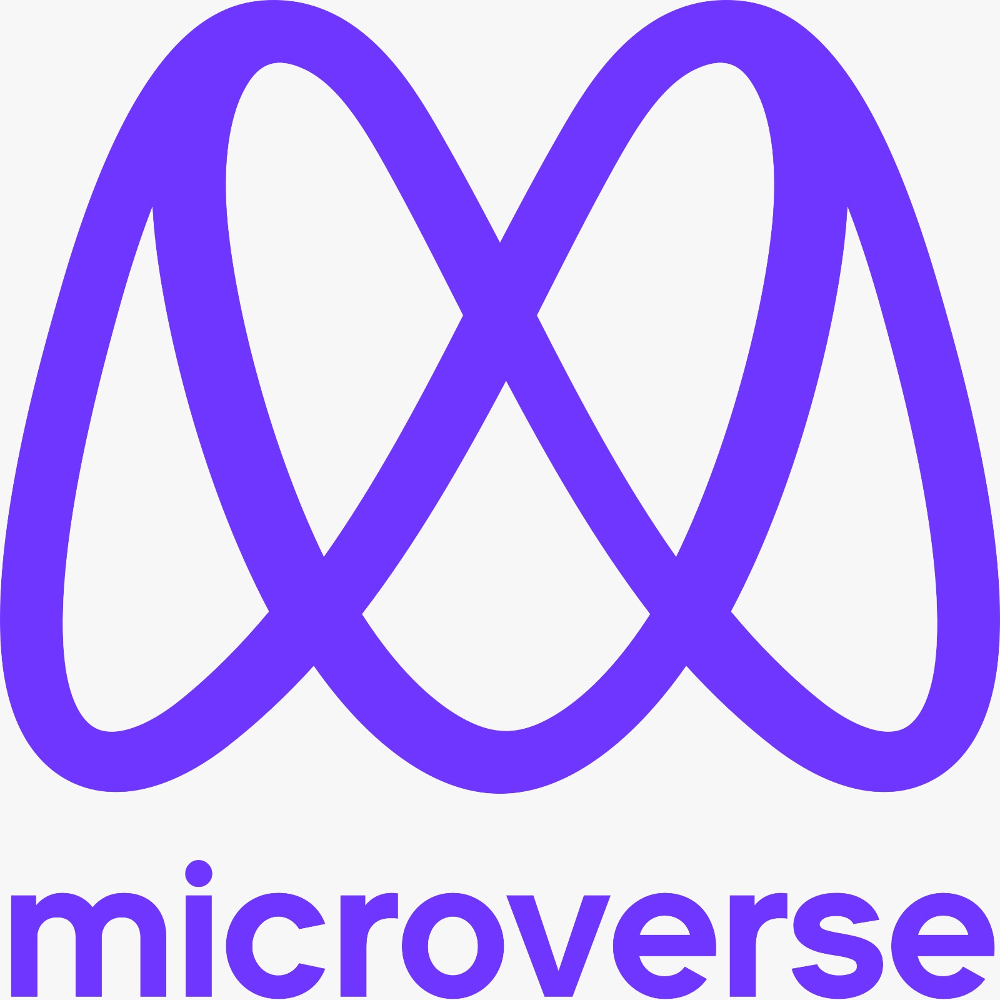

  
   

  <h3><b>Microverse README Template</b></h3>

# 📗 Table of Contents

- [📖 About the Project](#about-project)
  - [🛠 Built With](#built-with)
    - [Tech Stack](#tech-stack)
    - [Key Features](#key-features)
  - [🚀 Live Demo](#live-demo)
- [💻 Getting Started](#getting-started)
  - [Setup](#setup)
  - [Prerequisites](#prerequisites)
  - [Install](#install)
  - [Usage](#usage)
  - [Run tests](#run-tests)
  - [Deployment](#deployment)
- [👥 Authors](#authors)
- [🔭 Future Features](#future-features)
- [🤝 Contributing](#contributing)
- [⭐️ Show your support](#support)
- [🙏 Acknowledgements](#acknowledgements)
- [❓ FAQ (OPTIONAL)](#faq)
- [📝 License](#license)

# 📖 [your_project_name] 

Hello-Microverse is an amazing and simple html page with an h1 header in my awesemo color.

**[your_project__name]** is a...

## 🛠 Built With 

### Tech Stack 

HTML is a Markup language and CSS is a styling language for HTML pages.

  
Client

  <ul>
    <li><a href="https://reactjs.org/">React.js</a></li>
  </ul>

  
Server

  <ul>
    <li><a href="https://expressjs.com/">Express.js</a></li>
  </ul>

Database

  <ul>
    <li><a href="https://www.postgresql.org/">PostgreSQL</a></li>
  </ul>

### Key Features 

- **[professional]**
- **[Dynamic]**
- **[Responsive]**

(<a href="#readme-top">back to top</a>)

## 🚀 Live Demo 

- [Live Demo Link](https://google.com)

(<a href="#readme-top">back to top</a>)

## 💻 Getting Started 

To get a local copy up and running, follow these steps.

### Prerequisites
none

### Setup

Clone this repository to your desired folder:

### Install

Install this project with:

none

### Usage
clone
### Run tests

none

### Deployment
none

(<a href="#readme-top">back to top</a>)

## 👥 Authors 

👤 **Author1**

- GitHub: [https://github.com/kkmanuu](https://github.com/kkmanuu)
- Twitter: [@kkmanuu](https://twitter.com/twitter/kkmanuu)
- LinkedIn: [LinkedIn](https://www.linkedin.com/in/emmanuel-kipngeno-879370242/)

(<a href="#readme-top">back to top</a>)

## 🔭 Future Features 

- [ ] **[ Addimg crucial content]**
- [ ] **[Adding some dyanimic feature]**
- [ ] **[using responsive]**

(<a href="#readme-top">back to top</a>)

## 🤝 Contributing 

Contributions, issues, and feature requests are welcome!

Feel free to check the [issues page](../../issues/).

(<a href="#readme-top">back to top</a>)

## ⭐️ Show your support 

If you like this project follow me on GitHub

(<a href="#readme-top">back to top</a>)

## 🙏 Acknowledgments 

I would like to thank  Microverse for this opportunity.

(<a href="#readme-top">back to top</a>)

## ❓ FAQ (OPTIONAL) 

> Add at least 2 questions new developers would ask when they decide to use your project.

- **[Question_1]**

  - [Answer_1]

- **[Question_2]**

  - [Answer_2]

(<a href="#readme-top">back to top</a>)

## 📝 License 

This project is [MIT](./LICENSE) licensed.

(<a href="#readme-top">back to top</a>)
